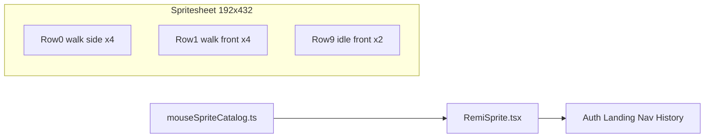

# Sprite sheet → animated REMi icons

## Sheet geometry (verified)

| Property | Value |
|----------|--------|
| File | [`assets/MouseSpritesheet-...png`](file:///Users/shouryayadav/.cursor/projects/Users-shouryayadav-Desktop-Projects-Personal-Projects-REMIv2-nosync-REMi/assets/MouseSpritesheet-16381547-d0fa-4a50-92a1-f312e7aef610.png) |
| Size | **192 × 432 px** |
| Grid | **4 columns × 12 rows** |
| Frame | **48 × 36 px** per cell |



## Row → clip catalog

Treat each row as one **clip** (animation state). Rows 10–12 use only the first two columns; still animate with `steps(2)`.

| Row | Clip id | Frames | Suggested use |
|-----|---------|--------|----------------|
| 0 | `walkSide` | 4 | Stream caret, “running” accents |
| 1 | `walkFront` | 4 | Landing hero, auth logo |
| 2 | `walkBack` | 4 | Rare / directional |
| 3 | `dashSide` | 4 | Login intro, high-energy moments |
| 4 | `powerFront` | 4 | Thinking / loading |
| 5 | `powerBack` | 4 | Optional |
| 6 | `attackSide` | 4 | Emphasis / success |
| 7 | `attackFront` | 4 | Optional |
| 8 | `attackBack` | 4 | Optional |
| 9 | `idleFront` | 2 | Nav micro icons, history cards, default shell icon |
| 10 | `idleSide` | 2 | Side-facing idle |
| 11 | `idleBack` | 2 | Back idle |

Do **not** try to map all 20+ [`AsciiMouseVariant`](librechat/client/src/components/Icons/asciiMouseCatalog.ts) keys to unique sprite rows. Reuse clips: e.g. all `ShellIcons` → `idleFront` (or `walkFront` on hover later).

## Architecture

### 1. Asset in the client bundle

- Copy sheet to [`librechat/client/public/assets/mouse-spritesheet.png`](librechat/client/public/assets/mouse-spritesheet.png) (served at `/assets/mouse-spritesheet.png`).
- **Transparency:** black `#000` will show as a box on glass panels. Run a one-time export (ImageMagick/Sharp) to turn black → alpha, or ship a preprocessed PNG. This is required for icons on `glass-card` / auth modal—not optional polish.

### 2. Catalog module (source of truth)

New file: [`librechat/client/src/components/Icons/mouseSpriteCatalog.ts`](librechat/client/src/components/Icons/mouseSpriteCatalog.ts)

```ts
export const SPRITE = {
  url: '/assets/mouse-spritesheet.png',
  cols: 4,
  rows: 12,
  frameW: 48,
  frameH: 36,
} as const;

export type MouseSpriteClip =
  | 'walkSide' | 'walkFront' | 'walkBack'
  | 'dashSide' | 'powerFront' | 'powerBack'
  | 'attackSide' | 'attackFront' | 'attackBack'
  | 'idleFront' | 'idleSide' | 'idleBack';

export type MouseSpriteClipDef = {
  row: number;      // 0-based
  frames: number;   // 2 or 4
  fps?: number;     // default 8
  loop?: boolean;   // default true
};

export const MOUSE_SPRITE_CLIPS: Record<MouseSpriteClip, MouseSpriteClipDef> = { ... };

// Helpers (pure, unit-testable)
export function clipBackgroundSize(scale: number): { w: number; h: number };
export function clipBackgroundPosition(clip: MouseSpriteClip, frameIndex: number, scale: number): string;
```

### 3. `RemiSprite` component

New file: [`librechat/client/src/components/Icons/RemiSprite.tsx`](librechat/client/src/components/Icons/RemiSprite.tsx)

**Rendering model:** a single `<span role="img">` with:

- `background-image: url(...)`
- `background-size`: full sheet scaled to `(cols × frameW × scale) × (rows × frameH × scale)`
- `background-position`: computed from `row` + current frame
- `image-rendering: pixelated` (crisp pixel art)
- `width` / `height`: `frameW × scale`, `frameH × scale`

**Animation:** CSS `@keyframes` per clip in [`librechat/client/src/components/Icons/mouseSprite.css`](librechat/client/src/components/Icons/mouseSprite.css), imported from `RemiSprite.tsx` or `style.css`:

```css
@keyframes remi-sprite-idleFront {
  from { background-position: 0 calc(var(--row) * var(--frame-h)); }
  to   { background-position: calc(-1 * var(--frames) * var(--frame-w)) calc(var(--row) * var(--frame-h)); }
}
.remi-sprite--idleFront {
  animation: remi-sprite-idleFront calc(var(--frames) / var(--fps) * 1s) steps(var(--frames)) infinite;
}
```

Use **CSS custom properties** on the element (`--row`, `--frames`, `--frame-w`, `--frame-h`, `--fps`) so one keyframes pattern can work for all clips, *or* generate 12 small keyframe blocks—both are fine; prefer one generic horizontal strip animation per row to avoid duplication.

**Props:**

| Prop | Purpose |
|------|---------|
| `clip` | Which row/animation |
| `scale` | Display multiplier (e.g. `0.5` → 24×18, `1` → 48×36, `2` → 96×72 hero) |
| `playing` | Default `true`; `false` → frame 0 |
| `className` | Tailwind hooks |
| `title` / `aria-label` | Accessibility |
| `data-testid` | Default `remi-sprite-mouse` (update tests that expect `remi-ascii-mouse`) |

**`prefers-reduced-motion`:** in [`style.css`](librechat/client/src/style.css) (existing reduced-motion block), force `animation: none` and `background-position` to frame 0.

### 4. Drop-in wrapper: `RemiMouse`

New [`RemiMouse.tsx`](librechat/client/src/components/Icons/RemiMouse.tsx) mirroring [`AsciiMouse.tsx`](librechat/client/src/components/Icons/AsciiMouse.tsx) API:

```ts
type RemiMouseProps = {
  clip?: MouseSpriteClip;
  scale?: number;
  size?: 'micro' | 'sm' | 'md' | 'hero';  // maps to scale presets
  ...
};
const SIZE_SCALE = { micro: 0.33, sm: 0.4, md: 0.55, hero: 1.25 };
```

Optional mapping from legacy variant → clip for gradual migration:

```ts
const VARIANT_TO_CLIP: Partial<Record<AsciiMouseVariant, MouseSpriteClip>> = {
  logoCompact: 'idleFront',
  logoHero: 'walkFront',
  micro: 'idleFront',
  peek: 'idleFront',
  thinking: 'powerFront',
  caret: 'walkSide',
  ...
};
```

### 5. Replace consumers (incremental)

| Location | Today | Target clip | Display scale |
|----------|-------|---------------|---------------|
| [`AuthLayout.tsx`](librechat/client/src/components/Auth/AuthLayout.tsx) | `logoCompact` | `idleFront` or `walkFront` | `md` |
| [`Landing.tsx`](librechat/client/src/components/Chat/Landing.tsx) | `logoHero` | `walkFront` | `hero` |
| [`RemiEmptyState.tsx`](librechat/client/src/components/Remi/RemiEmptyState.tsx) | `logoHero` | `walkFront` | `hero` |
| [`MouseHistoryPanel.tsx`](librechat/client/src/components/Remi/MouseHistoryPanel.tsx) | `micro` / `peek` | `idleFront` | `sm` |
| [`createAsciiShellIcon.tsx`](librechat/client/src/components/Icons/createAsciiShellIcon.tsx) | per-variant ASCII | `idleFront` (all) | `micro` via `size-full` parent |

Rename factory to `createRemiShellIcon` when swapping implementation; keep exports stable in [`shellIcons.tsx`](librechat/client/src/components/Icons/shellIcons.tsx).

### 6. Stream carets (special case)

Today, streaming uses **CSS `content: var(--remi-stream-caret)`** with monospace text ([`style.css` L2137–2216](librechat/client/src/style.css)). Sprites cannot be injected via `content:` without `url()` hacks.

**Recommended v1 approach:**

- Keep ASCII **only** for inline stream `::after` carets (smallest change), **or**
- Add a tiny absolutely-positioned `RemiSprite clip="walkSide" scale={0.35}` beside the streaming block via React in the message component (larger change, best visual).

Plan for icons first; tackle stream carets in a follow-up unless you want full ASCII removal in one pass.

## Size presets (starting point)

| Context | `scale` | Display px |
|---------|---------|------------|
| Nav / shell | ~0.35–0.45 | ~17–22 tall |
| History card | ~0.45 | ~16×22 |
| Auth header | ~0.55 | ~26×20 |
| Landing hero | ~1.25–1.5 | ~60–54 |

Tune after dropping into real `size-full` nav buttons (typically 20–24px).

## Testing

- **Unit:** `mouseSpriteCatalog.spec.ts` — frame math, background-position for row 0 frame 2, row 9 frame 1.
- **Component:** `RemiSprite.spec.tsx` — renders with `clip`, `playing={false}` shows frame 0, `data-testid`.
- **Update:** [`MouseHistoryPanel.spec.tsx`](librechat/client/src/components/Remi/MouseHistoryPanel.spec.tsx) — assert `remi-sprite-mouse` instead of `remi-ascii-mouse`.
- **Visual:** manual check on dark canvas + glass card for transparency.

## What we defer (login splash)

The animated login (“remi” text on black) reuses the same **`RemiSprite`** + clips (`dashSide`, `walkFront`) and CSS/text animations—it is a **composition layer** on top of this icon system, not a separate sprite pipeline. Build icons first, then splash screen.

## File checklist

| Action | File |
|--------|------|
| Add | `public/assets/mouse-spritesheet.png` (transparent) |
| Add | `mouseSpriteCatalog.ts` + spec |
| Add | `RemiSprite.tsx` + `mouseSprite.css` + spec |
| Add | `RemiMouse.tsx` (wrapper) |
| Edit | `AsciiMouse` consumers → `RemiMouse` |
| Edit | `createAsciiShellIcon` → sprite |
| Edit | `index.ts` / `shellIcons.tsx` exports |
| Later | `docs/design.md` — ASCII → pixel sprite identity |
| Later | Stream caret strategy |
